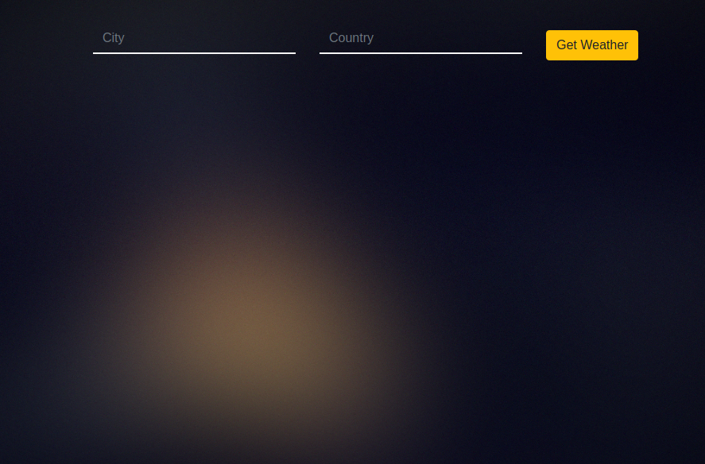
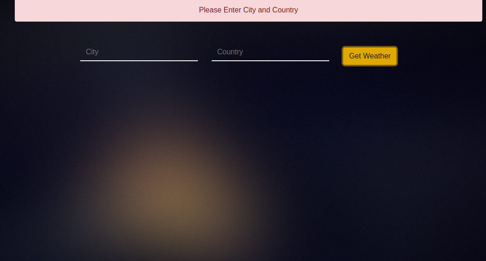
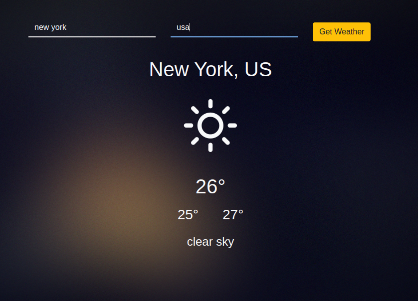
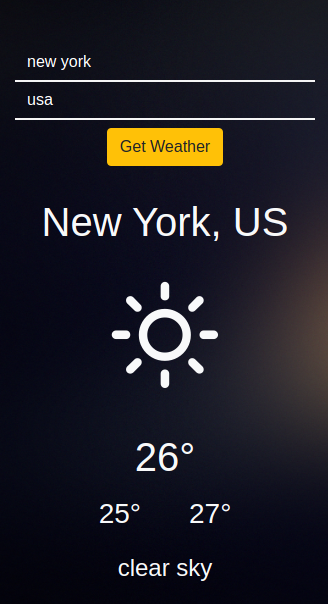

## Weather App
simple Reactjs application require the city and country
to get the weather details:
    - City, Country
    - Tempreature
    - Max tempreature
    - Min tempreature
    - Description

#### screenshots:

